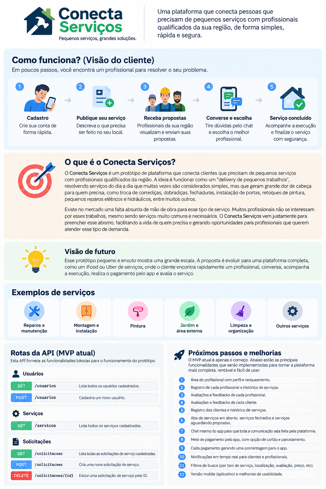
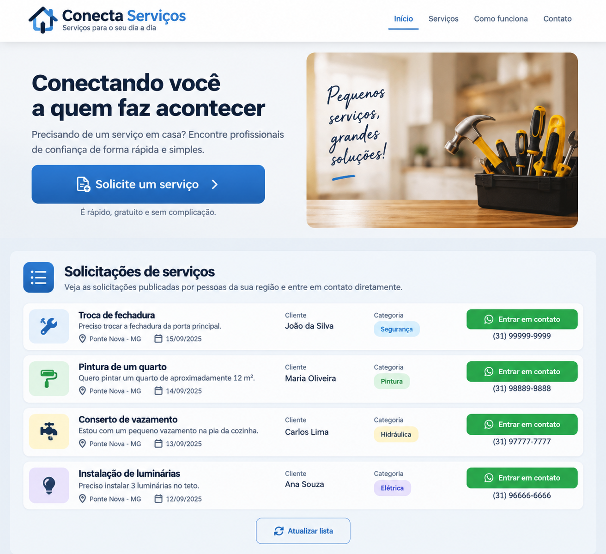

# Conecta Serviços API

API REST desenvolvida em Python com Flask para o projeto **Conecta Serviços**.

O sistema tem como objetivo conectar pessoas que precisam de pequenos serviços residenciais a profissionais que podem realizar esses serviços.

O projeto foi desenvolvido como MVP (Minimum Viable Product) para a disciplina de Engenharia de Software.

---

## Visão do projeto

### Fluxo do cliente

A proposta do Conecta Serviços é simplificar a contratação de pequenos serviços do dia a dia.



### Protótipo da aplicação

Abaixo está uma demonstração visual da interface desenvolvida para o MVP.



---

## Visão e propósito do projeto

### Uma ideia simples para um problema do dia a dia

Este protótipo é pequeno e enxuto, mas foi pensado para uma proposta que pode alcançar uma escala muito maior.

O **Conecta Serviços** nasceu da ideia de criar algo semelhante à experiência de aplicativos como iFood ou Uber, porém voltado para a contratação de **pequenos serviços e reparos do dia a dia**.

A proposta é funcionar como um verdadeiro **“delivery de pequenos trabalhos”**.

Existem diversos serviços que, apesar de serem simples, acabam se tornando um grande problema para quem precisa deles. São tarefas como:

- troca de corrediças;
- troca de dobradiças;
- troca de fechaduras;
- instalação e assentamento de portas;
- pequenos reparos elétricos e hidráulicos;
- retoques finais de pintura após uma obra;
- montagem de móveis;
- instalação de prateleiras, suportes e acessórios;
- pequenos serviços de manutenção em geral.

São serviços que fazem parte da rotina de muitas pessoas, mas que nem sempre são fáceis de encontrar profissionais disponíveis para executar.

A proposta do Conecta Serviços é justamente diminuir essa dificuldade.

### Como a ideia funciona

A pessoa entra na plataforma porque precisa resolver algum problema em sua casa, comércio ou outro local.

Ela informa:

- qual serviço precisa;
- onde o serviço será realizado;
- uma descrição do problema;
- seus dados para contato.

A solicitação fica disponível para profissionais que utilizam a plataforma.

Dessa forma, o profissional pode visualizar os serviços disponíveis e entrar em contato diretamente com o cliente.

A ideia é transformar um processo que muitas vezes envolve procura, espera e dificuldade para encontrar alguém disponível em uma experiência mais simples e organizada.

### Escala futura

O protótipo apresentado nesta disciplina representa apenas o início da ideia.

A proposta futura é transformar o Conecta Serviços em uma plataforma completa, na qual clientes e profissionais possam resolver todo o processo dentro do próprio sistema.

Entre as principais evoluções planejadas estão:

1. **Área do profissional**, com perfil, avaliações e ranqueamento conforme os serviços realizados.

2. **Histórico profissional**, permitindo que o cliente conheça os serviços realizados anteriormente pelo profissional.

3. **Avaliações e feedbacks dos profissionais**, permitindo que clientes avaliem a qualidade do serviço prestado.

4. **Avaliações e feedbacks dos clientes**, criando também um histórico de relacionamento para os profissionais.

5. **Cadastro e histórico dos clientes**, permitindo acompanhar os serviços já solicitados.

6. **Organização das solicitações**, separando serviços em aberto, serviços aguardando propostas e serviços concluídos.

7. **Chat interno**, permitindo que clientes e profissionais conversem diretamente dentro da plataforma.

8. **Pagamento pelo aplicativo**, permitindo pagamentos digitais e opções como cartão e parcelamento.

9. **Modelo de monetização**, no qual a plataforma poderá receber uma porcentagem de cada serviço realizado através do sistema.

10. **Notificações em tempo real**, informando novos serviços, propostas, mensagens e atualizações.

11. **Filtros e busca**, permitindo localizar serviços por cidade, categoria, preço, avaliação e outros critérios.

12. **Aplicativo para dispositivos móveis**, ampliando o acesso e facilitando a utilização da plataforma.

13. **Sistema de segurança e verificação de identidade**, aumentando a confiança entre clientes e profissionais.

14. **Geolocalização**, permitindo encontrar profissionais próximos ao local onde o serviço será realizado.

15. **Sistema de disponibilidade**, permitindo que profissionais informem horários e regiões em que estão disponíveis para atendimento.

16. **Acompanhamento do serviço**, permitindo ao cliente acompanhar o andamento do atendimento até sua conclusão.

### Visão do Conecta Serviços

A visão de longo prazo é criar uma plataforma simples de usar, mas com grande potencial de escala: um aplicativo de serviços capaz de conectar rapidamente quem **precisa resolver um pequeno problema** com quem **está disposto e preparado para resolvê-lo**.

O MVP apresentado neste projeto demonstra apenas uma parte dessa proposta, servindo como base para futuras evoluções do sistema.

---

## Objetivo do projeto

A API permite:

- cadastrar usuários;
- consultar usuários;
- consultar serviços;
- criar solicitações de serviços;
- consultar solicitações;
- excluir solicitações de serviços.

O projeto prioriza simplicidade, organização e funcionamento das principais funcionalidades de um marketplace de serviços.

---

## Tecnologias utilizadas

- Python
- Flask
- SQLite
- Flasgger
- Swagger / OpenAPI
- Flask-CORS

---

## Estrutura do projeto

```text
Conecta-servicos-api/
│
├── app.py
├── database.py
├── requirements.txt
├── README.md
└── .gitignore
```

---

## Rotas da API

### Usuários

| Método | Rota | Função |
|---|---|---|
| GET | `/usuarios` | Lista todos os usuários cadastrados |
| POST | `/usuarios` | Cadastra um novo usuário |

### Serviços

| Método | Rota | Função |
|---|---|---|
| GET | `/servicos` | Lista todos os serviços cadastrados |

### Solicitações

| Método | Rota | Função |
|---|---|---|
| GET | `/solicitacoes` | Lista todas as solicitações cadastradas |
| POST | `/solicitacoes` | Cria uma nova solicitação de serviço |
| DELETE | `/solicitacoes/{id}` | Exclui uma solicitação de serviço pelo ID |

---

## Documentação Swagger

A API possui documentação utilizando Swagger / OpenAPI através do Flasgger.

Com o backend em execução, acesse:

```text
http://127.0.0.1:5000/apidocs/
```

---

## Integração com o frontend

O frontend do Conecta Serviços é desenvolvido separadamente e utiliza a API para realizar as principais operações:

```text
GET  /servicos
GET  /usuarios
POST /usuarios
GET  /solicitacoes
POST /solicitacoes
DELETE /solicitacoes/{id}
```

---

## Fluxo principal

```text
Usuário acessa o sistema
        ↓
Visualiza os serviços disponíveis
        ↓
Preenche seus dados
        ↓
Escolhe um serviço
        ↓
Cria uma solicitação
        ↓
A solicitação recebe status "aberta"
        ↓
A solicitação aparece no frontend
        ↓
Outro usuário pode entrar em contato
        ↓
A solicitação pode ser excluída
```

---

## Execução do projeto

### 1. Criar o ambiente virtual

```bash
python -m venv .venv
```

### 2. Ativar o ambiente virtual

No Windows PowerShell:

```powershell
.venv\Scripts\Activate.ps1
```

### 3. Instalar as dependências

```bash
pip install -r requirements.txt
```

### 4. Executar a API

```bash
python app.py
```

A API será executada em:

```text
http://127.0.0.1:5000
```

A documentação Swagger estará disponível em:

```text
http://127.0.0.1:5000/apidocs/
```

---

## Projeto acadêmico

Projeto desenvolvido como MVP para a disciplina de **Engenharia de Software**, com o objetivo de aplicar conceitos de desenvolvimento de APIs, banco de dados, integração entre frontend e backend e documentação de serviços REST.